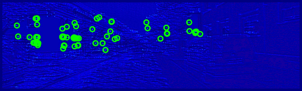
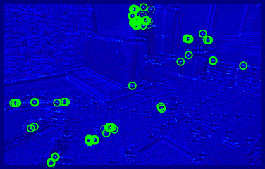
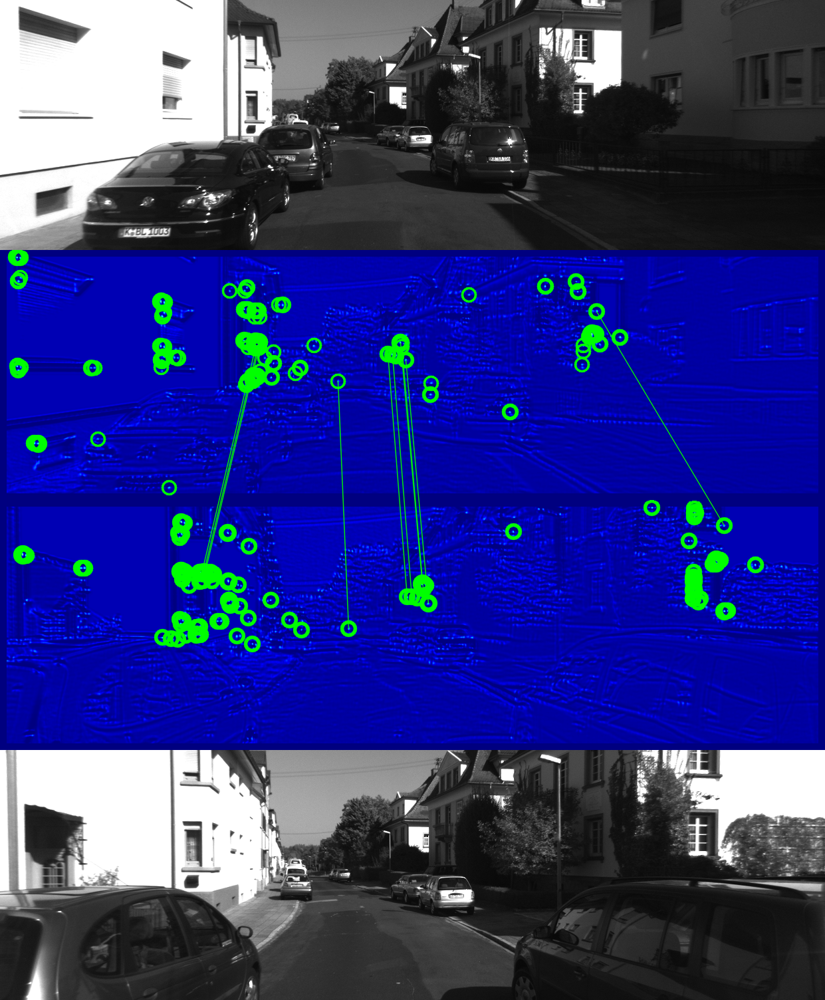
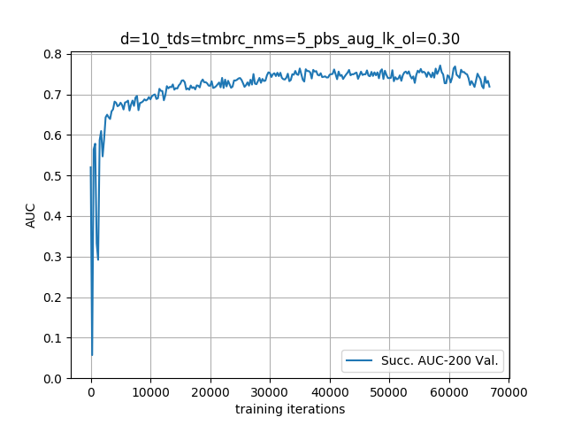

# SIPs: Succinct Interest Points from Unsupervised Inlierness Probability Learning




This is the code for the 2019 3DV paper **SIPs: Succinct Interest Points from Unsupervised Inlierness Probability Learning** by [Titus Cieslewski](http://rpg.ifi.uzh.ch/people_titus.html), [Kosta Derpanis](http://scs.ryerson.ca/~kosta/) and [Davide Scaramuzza](http://rpg.ifi.uzh.ch/people_scaramuzza.html). When using this, please cite:

```bib
@InProceedings{Cieslewski19threedv,
  author        = {Titus Cieslewski and Konstantinos G. Derpanis and Davide Scaramuzza},
  title         = {SIPs: Succinct Interest Points
                  from Unsupervised Inlierness Probability Learning},
  booktitle     = {3D Vision (3DV)},
  year          = 2019
}
```

If you are looking to minimize the amount of data necessary for feature matching, you might also be interested in our related work [**Matching Features without Descriptors: Implicitly Matched Interest Points**](https://github.com/uzh-rpg/imips_open).

## Supplementary Material

The supplementary material mentioned in the paper can be found at http://rpg.ifi.uzh.ch/datasets/sips2/supp_sips_3dv.zip .

## Installation

We recommend working in a [virtual environment](https://packaging.python.org/guides/installing-using-pip-and-virtual-environments/) (also when using ROS/catkin)
```bash
pip install --upgrade opencv-contrib-python==3.4.2.16 opencv-python==3.4.2.16 ipython \
    pyquaternion scipy absl-py hickle matplotlib sklearn tensorflow-gpu cachetools
```

### With ROS/catkin

```bash
sudo apt install python-catkin-tools
mkdir -p sips_ws/src
cd sips_ws
catkin config --init --mkdirs --extend /opt/ros/<YOUR VERSION> --merge-devel
cd src
git clone git@github.com:catkin/catkin_simple.git
git clone git@github.com:uzh-rpg/sips2_open.git
git clone git@github.com:uzh-rpg/imips_open_deps.git
catkin build
. ../devel/setup.bash
```

### Without ROS/catkin

```bash
mkdir sips_ws
cd sips_ws
git clone git@github.com:uzh-rpg/sips2_open.git
git clone git@github.com:uzh-rpg/imips_open_deps.git
```
Make sure `imips_open_deps/rpg_common_py/python`, `imips_open_deps/rpg_datasets_py/python` and `sips2_open/python` are in your `PYTHONPATH`.

### Get pre-trained weights

Download the weights from http://rpg.ifi.uzh.ch/datasets/sips2/d=10_tds=tmbrc_nms=5_pbs_aug_lk_ol=0.30_best.zip and extract them into `python/sips2/checkpoints`.

## Inference

### Infer any image folder

```bash
python infer_folder.py --in_dir=INPUT_DIR [--num_test_pts=N] [--out_dir=OUTPUT_DIR] [--ext=.EXTENSION]
```
`--num_test_pts` can be specified to extract a given amount of interest points, otherwise a default of 500 points will be extracted.
As shown in the paper, much less points (50-100) are required to establish relative pose in typical robotics datasets.
If no output directory is provided, it will be `$HOME/imips_out/INPUT_DIR`.
`ext` can be used to specify image extensions other than `.jpg` or `.png` (add the dot).

### Test using our data

Follow [these instructions](https://github.com/uzh-rpg/imips_open_deps/tree/master/rpg_datasets_py) to link up KITTI. To speed things up, you can download http://rpg.ifi.uzh.ch/datasets/imips/tracked_indices.zip and extract the contained files to `python/sips2/tracked indices` (visual overlap precalculation). Then, run:
```bash
python render_matching.py --ds=kt --val_best --testing
```
This will populate `results/match_render/d=10_tds=tmbrc...` with images like the following:



## Training

(Re)move the previously downloaded checkpoints. Follow [these instructions](https://github.com/uzh-rpg/imips_open_deps/tree/master/rpg_datasets_py) to link up TUM mono and Robotcars. Then, run:
```bash
python train.py
```

To visualize training progress, you can run:
```bash
python plot_val_metrics.py
```
in parallel. Here is what it should look like after over 60k iterations:



## Acknowledgments

This work was supported by the National Centre of Competence in Research (NCCR) Robotics through the Swiss National Science Foundation and the SNSF-ERC Starting Grant. The Titan Xp used for this research was donated by the NVIDIA Corporation.  Konstantinos G. Derpanis is supported by a Canadian NSERC Discovery grant. He contributed to this work in his personal capacity as an Associate Professor at Ryerson University.
